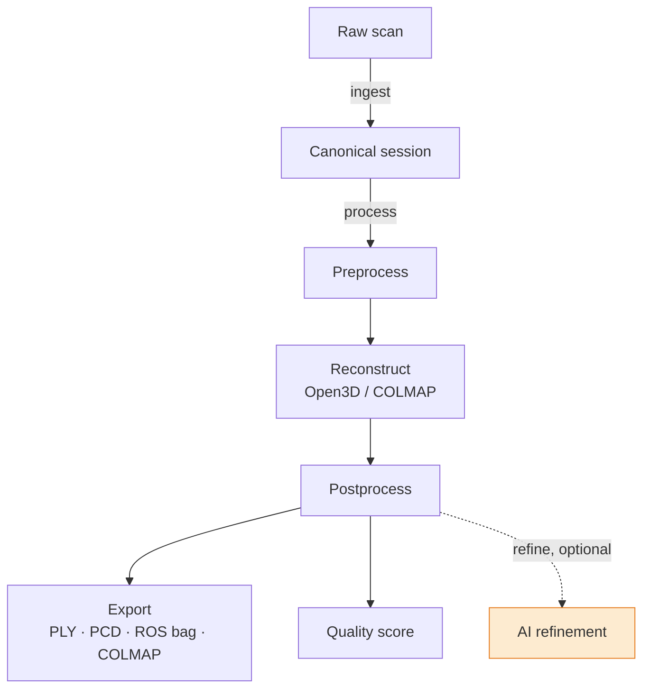
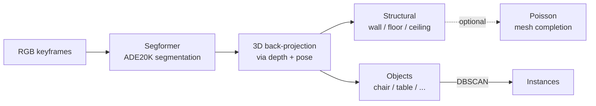
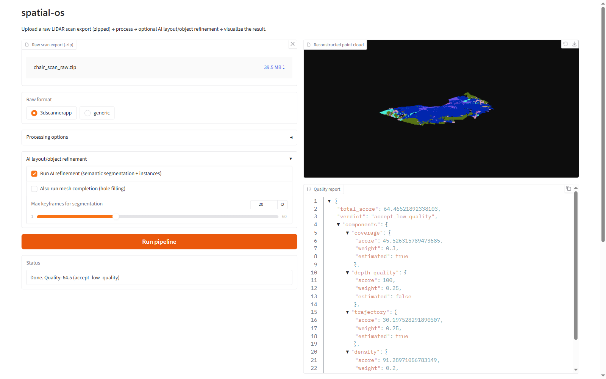

<div align="center">

<a href="https://home-ashen-one.vercel.app/#top">
  
</a>

### spatial-os

**Backend processing pipeline for raw smartphone LiDAR point cloud sessions.**

Turns raw scans captured with an iPhone LiDAR scanning app into standard,
ML/robotics-ready outputs — with an optional AI layout/object understanding
stage on top.

[Website](https://home-ashen-one.vercel.app/#top) ·
[Getting Started](docs/getting-started.md) ·
[Architecture](docs/architecture.md) ·
[AI Refinement](docs/refine.md) ·
[Web UI](docs/webapp.md) ·
[Docker](docs/docker.md)

</div>

---

## 1. Overview

`spatial-os` is the backend half of the [SpatialOS](https://home-ashen-one.vercel.app/#top)
platform — a crowdsourced initiative to turn everyday smartphones into
spatial data collection devices for robotics, embodied AI, and spatial
foundation models.

This package does **not** include the mobile app or the full crowdsourced
cloud infrastructure (upload API, job queue, database — that's a larger,
separate build). Instead, it's a standalone, pip-installable / Dockerized
package that takes point cloud data you've already collected and turns it
into something usable: **PLY / PCD**, **ROS bag**, **COLMAP sparse + dense**
(NeRF-ready), an automated **0–100 quality score**, and an optional
**AI layout/object understanding** stage.

See the [design doc](../2026-05-28-spatialos-lidar-data-collection-design.pdf)
for the full platform vision this project is a part of.

## 2. Pipeline



See [docs/architecture.md](docs/architecture.md) for the full, module-level diagram.

## 3. Quick start

See [docs/getting-started.md](docs/getting-started.md) for the full tutorial.
To capture your own raw data first, see [docs/data-capture.md](docs/data-capture.md).

```bash
pip install -e .
spatial-os ingest path/to/raw_export --format 3dscannerapp --output ./session
spatial-os process ./session --format ply,rosbag,colmap --output ./out
spatial-os score ./session --ply ./out/cloud.ply
```

Or with Docker (see [docs/docker.md](docs/docker.md)):

```bash
docker build -t spatial-os .
docker run --rm -v "${PWD}/data:/data" spatial-os process /data/session --output /data/out --format ply,rosbag,colmap
```

Or launch the web UI end-to-end (upload → process → AI refine → visualize):

```bash
docker build -f Dockerfile.app -t spatial-os-app .
docker run --rm -p 7860:7860 spatial-os-app
```

## 4. AI in the pipeline

The reconstruction pipeline itself (Open3D TSDF fusion, outlier removal,
voxel downsampling) is classical geometry processing — deterministic and
fast. AI enters at the **refinement stage** (`spatial-os refine`, optional,
requires the `ai` extra), where the goal shifts from "produce a clean point
cloud" to "understand what's in the scan":



This is a deliberate **2D-model + geometric-projection** design rather than a
native 3D deep-learning model: mature, well-supported semantic segmentation
checkpoints are abundant for 2D images and scarce/heavy for raw 3D point
clouds. By reusing the depth + pose data the reconstruction stage already
computed, a standard 2D model gets most of the value (per-point wall/floor/
ceiling/furniture labels, per-object instances) without pulling in a
specialized 3D model stack. See [docs/refine.md](docs/refine.md) for the full
design writeup, including why mesh completion is classical (Poisson) rather
than a learned model today, and where a native 3D model could be swapped in
later behind the existing `Segmenter` interface.

## 5. Real-world use cases

Because the same crowdsourced scan can be exported into multiple standard
formats, `spatial-os` output is reusable across quite different downstream
applications.

**Robotics & embodied AI training data.** The ROS bag export
(`sensor_msgs/PointCloud2` + `nav_msgs/Path`) plugs directly into existing
ROS navigation stacks and simulators. Combined with the quality score, teams
can filter a crowdsourced corpus down to only high-quality, well-covered
scans before using them to train navigation, obstacle-avoidance, or
manipulation policies — instead of hand-collecting every training scene with
dedicated robotics hardware (LiDAR-equipped mobile robots, structured-light
rigs), any contributor's iPhone becomes a data collection device.

**Indoor mapping & navigation.** Multi-session fusion (`spatial-os fuse`)
merges several independent scans of the same space (different visits,
different contributors, different times of day) into one unified map via
global registration + ICP — the same approach used to build persistent indoor
maps for building navigation apps, wayfinding for accessibility, or
warehouse/facility layout tracking, without needing a dedicated mapping robot
sweep.

**NeRF / novel-view synthesis & digital twins.** The COLMAP-format export
(camera poses + dense point cloud, written directly from ARKit poses — no
COLMAP binary required) is immediately consumable by `nerfstudio` or
`instant-ngp` for neural radiance field training. This is the same pipeline
shape used for virtual staging in real estate, museum/cultural-heritage
digitization, and pre-visualization for film/VFX — but sourced from a
consumer phone scan instead of a professional photogrammetry rig.

**Spatial understanding & scene semantics.** The AI refinement stage's
per-point structural labels (wall/floor/ceiling) and per-object instances
(chairs, tables, sofas, …) turn a "just geometry" point cloud into a scene
graph-ready dataset — useful for embodied-AI agents that need to reason about
*what* is in a room, not just its shape (e.g. "navigate to the chair," "avoid
the table"), and for building semantic floor plans for facility management,
insurance/property-condition documentation, and construction progress
tracking (comparing scans of the same space over time).

**Crowdsourced spatial foundation model data.** At platform scale (see the
full [SpatialOS](https://home-ashen-one.vercel.app/#top) design), many
contributors scanning many real indoor spaces produces exactly the kind of
diverse, real-world, ground-truthed 3D dataset that spatial/embodied
foundation models are currently starved of — most existing indoor 3D
datasets (ScanNet, Matterport3D, Replica) are small, curated, and expensive
to extend, whereas a phone-based, quality-scored, crowdsourced pipeline can
scale with contributor count rather than dedicated capture budget.

## 6. Example: real LiDAR sample scan

Processed with `spatial-os process` (+ `spatial-os refine`) from a real "3D
Scanner App" export (`chair_scan`, from
[laanlabs/3dScannerApp_samples](https://github.com/laanlabs/3dScannerApp_samples)),
then visualized via `spatial-os ui`:



## 7. Development

```bash
pip install -e ".[dev]"
pytest
```

Tests run entirely against a synthetic fixture (no network, no COLMAP
required). See [docs/quality-scoring.md](docs/quality-scoring.md) and
[docs/colmap-tradeoffs.md](docs/colmap-tradeoffs.md) for design tradeoffs.

## 8. Documentation

| Doc | Covers |
|---|---|
| [docs/getting-started.md](docs/getting-started.md) | Install → ingest → process → interpret output |
| [docs/data-capture.md](docs/data-capture.md) | Capturing a raw scan with the iPhone LiDAR app |
| [docs/architecture.md](docs/architecture.md) | Module-level pipeline breakdown |
| [docs/refine.md](docs/refine.md) | AI refinement stage design & tradeoffs |
| [docs/webapp.md](docs/webapp.md) | Gradio web UI usage |
| [docs/docker.md](docs/docker.md) | Docker images & running tests in-container |
| [docs/quality-scoring.md](docs/quality-scoring.md) | Quality score components, what's real vs. estimated |
| [docs/colmap-tradeoffs.md](docs/colmap-tradeoffs.md) | Why COLMAP is optional/Docker-only |
