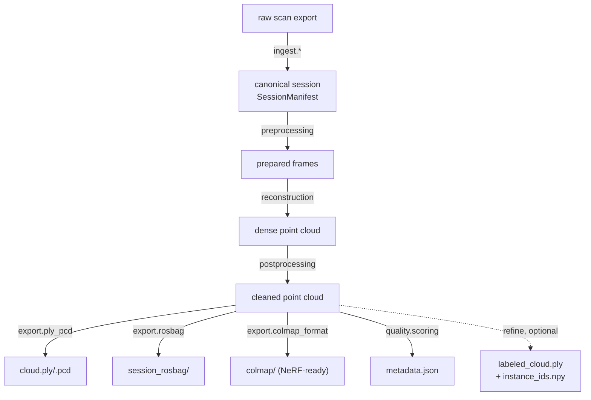

# Architecture

`spatial-os` implements the **Reconstruction Pipeline** stage of the full
SpatialOS platform design (see the project-level design PDF), as a
standalone CLI/package rather than the full crowdsourced cloud service. It
intentionally does not include the mobile app, upload API, job queue,
database, or object storage — those are a separate, larger build once this
processing core is validated.

Legend: `reconstruction` = `spatial_os.reconstruction.open3d_backend` (default)
or `.colmap_backend` (optional, Docker-only, see [colmap-tradeoffs.md](colmap-tradeoffs.md)).
`refine` = `spatial_os.refine.pipeline` (optional, `ai` extra, see [refine.md](refine.md)).

`spatial_os.fusion.multi_session` (invoked via `spatial-os fuse`) is a
separate, secondary path that merges multiple already-processed sessions'
point clouds — it is not part of the `process` command's critical path,
matching the design doc's treatment of "Global Map Fusion" as a
multi-session, cross-scan operation rather than a per-session step.

Every stage is a plain function operating on Open3D/NumPy objects, callable
independently of the CLI — `cli.py` and `pipeline.py` are thin orchestration
layers over `preprocessing/`, `reconstruction/`, `postprocessing/`,
`export/`, and `quality/`.

`spatial_os.refine.pipeline` (invoked via `spatial-os refine`, or the
"AI layout/object refinement" toggle in the web UI) is likewise a separate,
optional path that consumes a `process`d point cloud plus the original
session's keyframes — see [refine.md](refine.md) for its own internal
pipeline (2D segmentation → 3D back-projection → instance clustering →
optional mesh completion). `spatial_os.webapp` (`spatial-os ui`) is a thin
Gradio wrapper around `pipeline.run_process` and `refine.pipeline.run_refine`
— no logic lives in the web layer itself.
